<p align="center">
  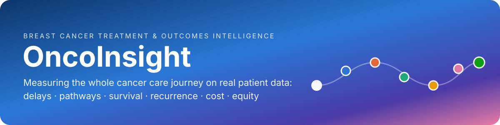
</p>

<p align="center">
  
  
  
  
  
  
  <a href="https://github.com/RajivPraveen/OncoInsight/actions/workflows/ci.yml"></a>
  
</p>

<p align="center">
  <b><a href="#-why-this-project-exists">Why</a></b> ·
  <b><a href="#-the-patient-journey-we-measure">Journey</a></b> ·
  <b><a href="#-a-tour-of-the-dashboard">Dashboard tour</a></b> ·
  <b><a href="#-what-the-data-says">Findings</a></b> ·
  <b><a href="#%EF%B8%8F-what-happens-when-you-run-it">How it works</a></b> ·
  <b><a href="#-run-it-yourself">Run it</a></b> ·
  <b><a href="#-faq">FAQ</a></b>
</p>

> **OncoInsight** is an end-to-end, production-style analytics platform for an oncology network. It follows
> **1,098 real breast cancer patients** from diagnosis through surgery, chemotherapy, radiation, endocrine and
> HER2-targeted therapy to recurrence or survival. It measures **where delays happen, which treatment pathways
> patients follow, how outcomes and costs differ, and whether care is equitable.** Everything runs on real,
> public, de-identified data: no synthetic patients.

---

## 🎯 Why this project exists

Breast cancer is the most commonly diagnosed cancer in women, and its treatment is a **relay race**. A surgeon,
a medical oncologist, a radiation oncologist and a pharmacy team each hand the patient to the next, often over
6–12 months. Every hand-off can add delay, and delay matters:

> 📌 Starting adjuvant chemotherapy **more than 90 days** after surgery is associated with **worse survival**
> (Chavez-MacGregor et al., *JAMA Oncology*, 2016).

An oncology network's leadership therefore asks questions that **no single prediction model answers**:

| ❓ The question leadership asks | 🧰 How OncoInsight answers it |
|---|---|
| ⏱️ How long from diagnosis to treatment, and where are the bottlenecks? | Interval marts, site benchmarks, a live delay-threshold slider |
| 🔀 Which treatment pathways do patients actually follow? | Pathway sequencing from real treatment dates, Sankey + drill-down treemap |
| 👥 Which patient groups wait longest? | Distributions by stage/subtype/age/race + adjusted logistic & median regression |
| 🏥 Do hospitals differ once you account for how sick their patients are? | Case-mix-adjusted **observed ÷ expected** ratios with exact 95% CIs |
| 📈 How do survival and recurrence differ by stage, biology and pathway? | Kaplan-Meier, log-rank, **RMST**, Cox models (TCGA + METABRIC validation) |
| 🔁 Who is at highest risk of recurrence? | Recurrence rates by factor + 5-year relapse models (CV AUC ≈ 0.71) |
| 💵 What does each pathway cost, and what would a policy change save? | CMS 2026 reference-priced cost lines + a **what-if simulator** |
| ⚖️ Is access to guideline-indicated treatment equitable? | Concordance measures by group, Wilson CIs, FDR-corrected tests |
| 🚨 Did a KPI move unexpectedly this period? | Automated KPI monitor → alerts (+ webhook) |
| 🤖 Can an analyst just *ask*? | Claude assistant restricted to governed metrics + validated read-only SQL |

**Why it's built as a platform, not a notebook:** the answers are only trustworthy if the data behind them is
reproducible, validated, incremental, tested and traceable. So the project has the parts a real analytics
team relies on: FHIR ingestion, quality gates, a dbt star schema, orchestration, CI/CD, IaC and documentation.

---

## 🧭 The patient journey we measure

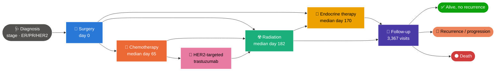
```mermaid
flowchart LR
    DX([🩺 Diagnosis<br/>stage · ER/PR/HER2]):::dx --> SX[🔪 Surgery<br/>day 0]:::surg
    SX --> CH[💉 Chemotherapy<br/>median day 65]:::chemo
    SX --> RT[☢️ Radiation<br/>median day 182]:::rad
    SX --> EN[💊 Endocrine therapy<br/>median day 170]:::endo
    CH --> H2[🎯 HER2-targeted<br/>trastuzumab]:::her2
    CH --> RT
    RT --> EN
    H2 --> RT
    EN --> FU[📅 Follow-up<br/>3,367 visits]:::fu
    RT --> FU
    FU --> OK([✅ Alive, no recurrence]):::good
    FU --> RE([🔁 Recurrence / progression]):::warn
    FU --> DE([⚫ Death]):::bad
    classDef dx fill:#52514e,color:#fff,stroke:#fff
    classDef surg fill:#2a78d6,color:#fff,stroke:#fff
    classDef chemo fill:#eb6834,color:#fff,stroke:#fff
    classDef rad fill:#1baf7a,color:#fff,stroke:#fff
    classDef endo fill:#eda100,color:#000,stroke:#fff
    classDef her2 fill:#e87ba4,color:#000,stroke:#fff
    classDef fu fill:#4a3aa7,color:#fff,stroke:#fff
    classDef good fill:#0ca30c,color:#fff,stroke:#fff
    classDef warn fill:#ec835a,color:#000,stroke:#fff
    classDef bad fill:#d03b3b,color:#fff,stroke:#fff
```

Every step above is a **real, dated treatment record** from the NCI Genomic Data Commons, converted to FHIR R4.
Who are the patients?

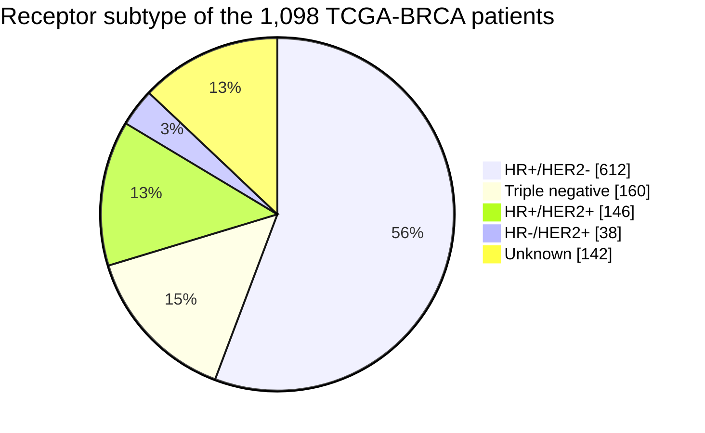
```mermaid
pie showData title Receptor subtype of the 1,098 TCGA-BRCA patients
    "HR+/HER2-" : 612
    "Triple negative" : 160
    "HR+/HER2+" : 146
    "HR-/HER2+" : 38
    "Unknown" : 142
```

<p align="center">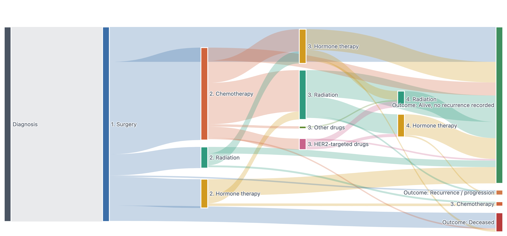<br>
<sub><b>Real flows, not a diagram.</b> Diagnosis → ordered first starts of each modality → outcome. Link colour = the step the patient is leaving.</sub></p>

---

## 📸 A tour of the dashboard

A 13-page Streamlit app. One **cohort filter row** (diagnosis year, stage, subtype, age, site type) scopes every
chart on every page, and most charts are clickable.

| | |
|---|---|
| 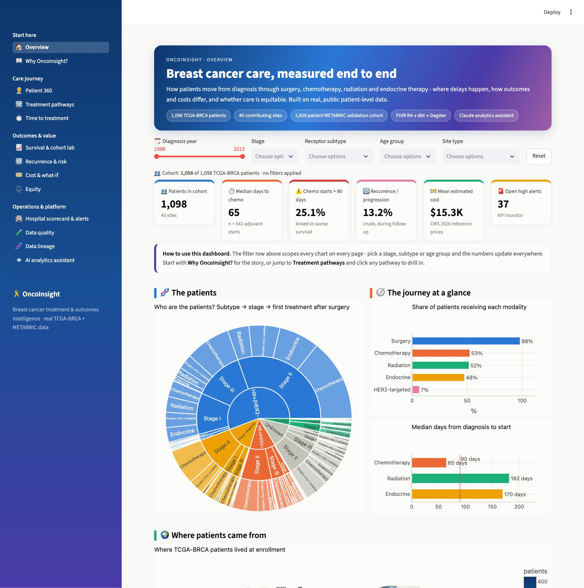<br>**🏠 Overview**: colour-coded KPIs, a subtype → stage → first-treatment sunburst, modality mix, and a world map of where patients lived. | 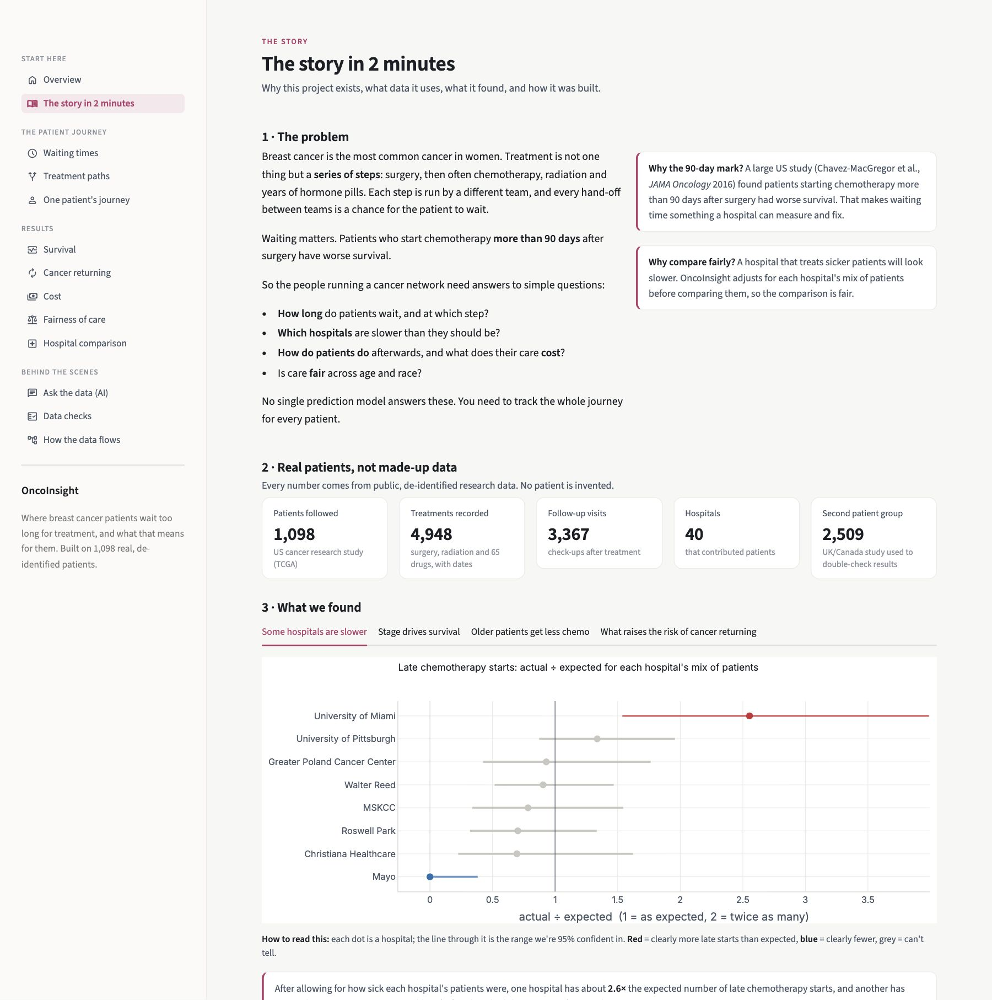<br>**📖 Why OncoInsight?**: the story told in the app itself: the problem, the journey, the data, the 8 pipeline steps (with live pass rates) and the headline findings. |
| 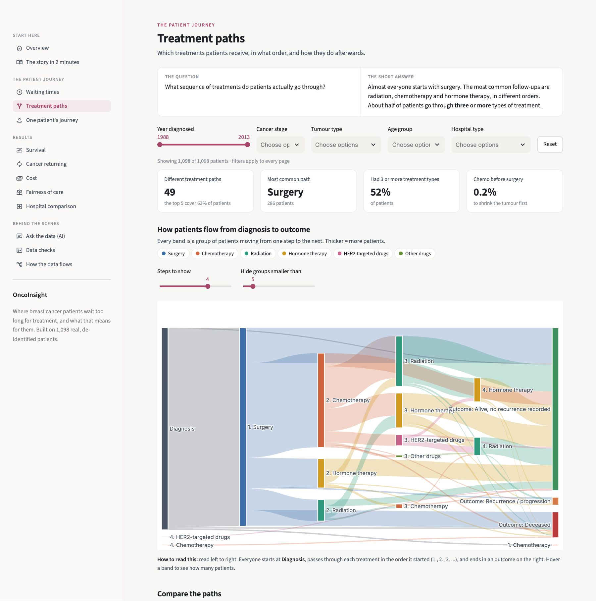<br>**🔀 Treatment pathways**: a cohort-filtered Sankey, a **click-to-drill** treemap (tile → patient list) and gaps between consecutive modalities. | 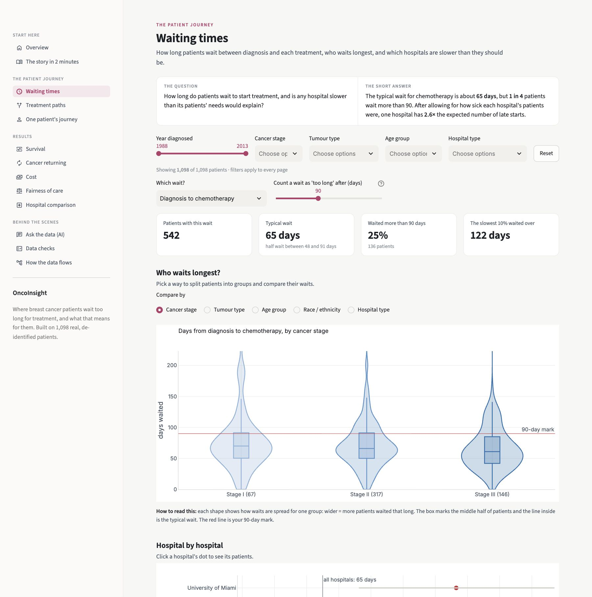<br>**⏱️ Time to treatment**: a **delay-threshold slider** recomputes every rate, violins by group, **clickable** site benchmarks, O/E and a site × interval heatmap. |
| 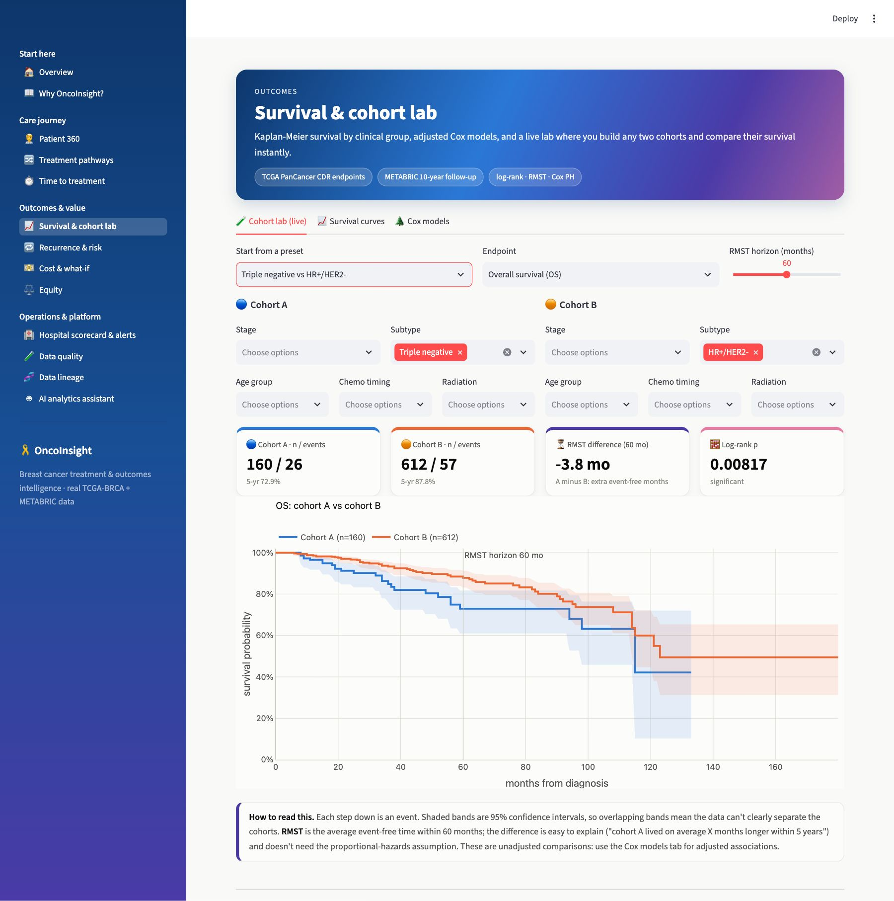<br>**📈 Survival & cohort lab**: build *any* two cohorts and get live Kaplan-Meier curves, 5-year survival, **RMST difference** and a log-rank test. | 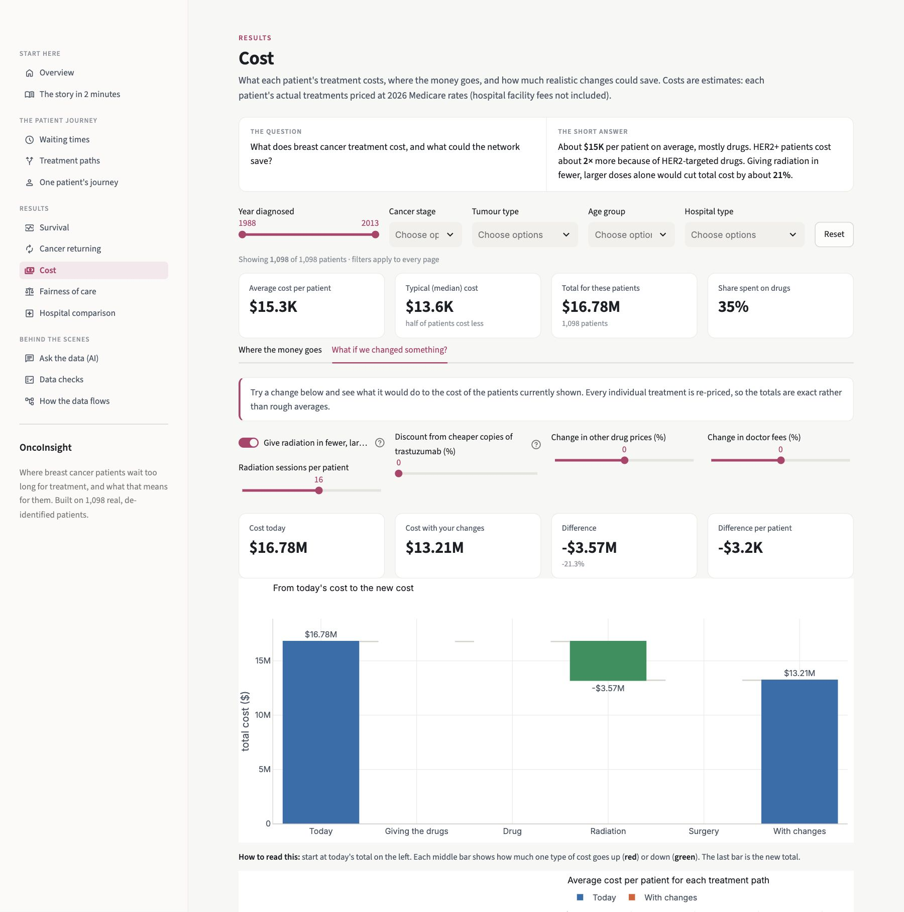<br>**💵 Cost & what-if**: move levers (hypofractionation, trastuzumab biosimilars, drug prices, fee schedule) and see a cost bridge and per-pathway impact. |
| 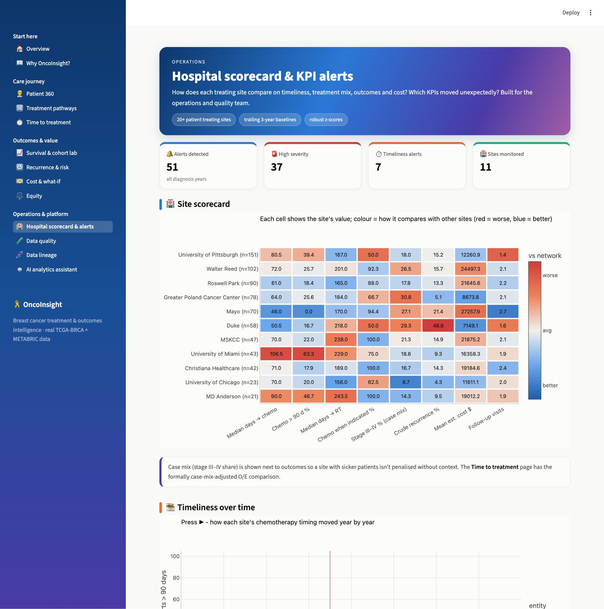<br>**🏥 Hospital scorecard & alerts**: a diverging scorecard heatmap, an **animated** year-by-year bubble chart (press ▶), a KPI explorer and the alert feed. | 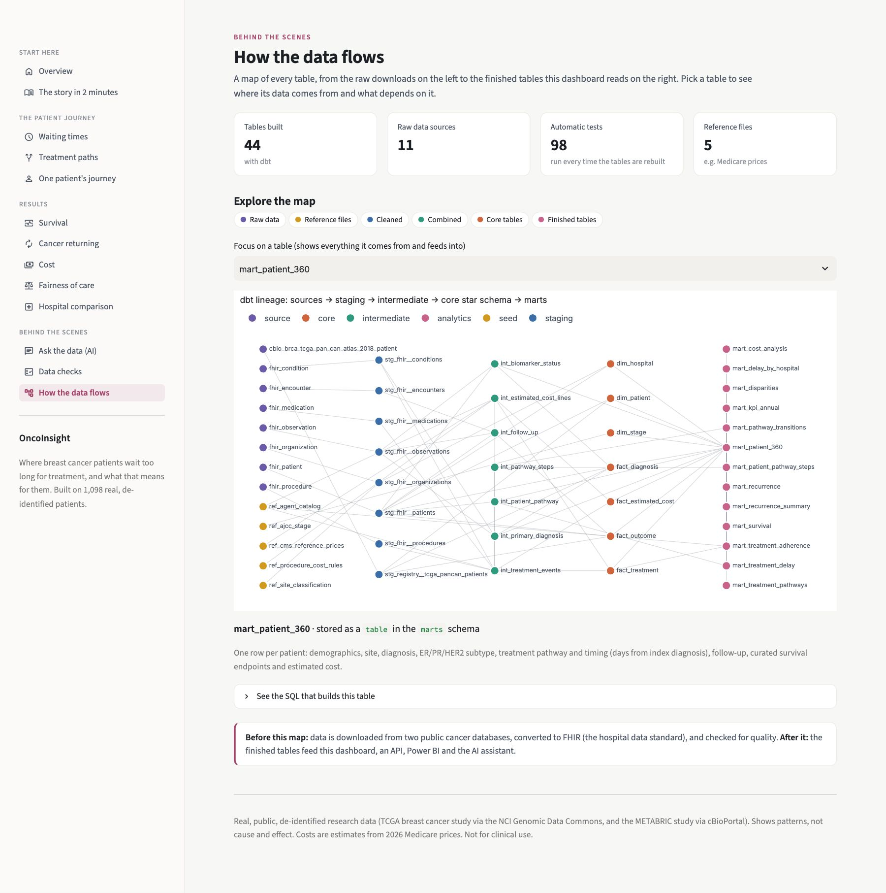<br>**🧬 Data lineage**: an interactive dbt graph generated from the manifest. Focus any model to see everything upstream and downstream. |

<details>
<summary><b>🗺️ All 13 pages and what you can do on each (click to expand)</b></summary>

| Section | Page | Interactions |
|---|---|---|
| Start here | 🏠 Overview | Cohort filters, sunburst hover/zoom, world map |
| | 📖 Why OncoInsight? | Tabs for each finding, page links to explore further |
| Care journey | 🧑‍⚕️ Patient 360 | Filter by pathway/outcome/site, 🎲 random patient, treatment timeline with follow-up markers and recurrence line |
| | 🔀 Treatment pathways | Sankey depth + minimum-flow sliders, colour-by selector, **click a treemap tile** for its patients |
| | ⏱️ Time to treatment | Interval picker, **threshold slider (30–180 d)**, compare-by selector, **click a site** for its patients, 3 analysis tabs |
| Outcomes & value | 📈 Survival & cohort lab | 6 presets or custom cohorts A/B, endpoint (OS/DSS/PFI), RMST horizon, Cox model picker with PH diagnostics |
| | 🔁 Recurrence & risk | Rates by factor, calibration + feature importance, **interactive risk gauge** |
| | 💵 Cost & what-if | Break-down selector, cost-vs-outcome value map, **4-lever scenario simulator** with waterfall |
| | ⚖️ Equity | Measure × stratifier with Wilson CIs, group × measure heatmap, FDR-highlighted tests table |
| Operations & platform | 🏥 Hospital scorecard & alerts | Scorecard heatmap, **animated** timeliness chart, KPI trend with ◆ alert markers, filterable alert feed |
| | 🧪 Data quality | Expectation results by dataset, open findings with samples, pipeline run timeline |
| | 🧬 Data lineage | Focus any model, view compiled SQL |
| | 🤖 AI analytics assistant | Chat (with audited queries), one-click example questions, governed metric explorer + chart |

Every table has a **⬇️ Download CSV** button, and groups under 11 patients are suppressed.
</details>

---

## 💡 What the data says

<table>
<tr>
<td width="50%">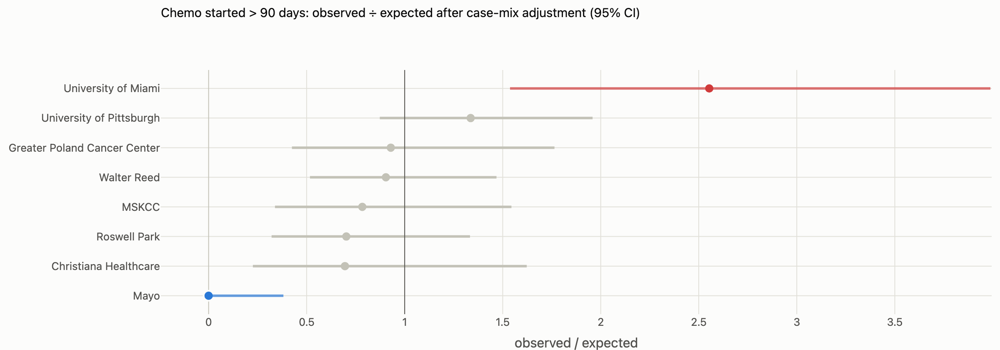</td>
<td width="50%">

### ⏱️ 1 in 4 chemo starts are late, and one site is 2.6× worse than expected

- Median diagnosis → adjuvant chemotherapy: **65 days**. **25.1%** start after 90 days.
- After adjusting for stage, subtype and age, **University of Miami** has **2.55×** the expected share of late
  starts (95% CI 1.54–3.99). **Mayo** had none (O/E 0.00, CI 0–0.38).
- **Why it matters:** this points to a *process* difference (referral, scheduling, capacity) rather than
  sicker patients, which is exactly the lead a quality team needs.

</td>
</tr>
<tr>
<td>

### 📈 Stage and tumour biology drive survival

- 5-year overall survival: **91%** (stage I) → **86%** (II) → **73%** (III) → **27%** (IV); log-rank p = 8×10⁻²⁰.
- Triple-negative disease has the lowest 5-year OS (**73%**). Cox model C-index **0.82**.
- Validated in METABRIC (n = 1,800): age, nodal burden, tumour size and HER2+ status are independently associated
  with mortality.

</td>
<td>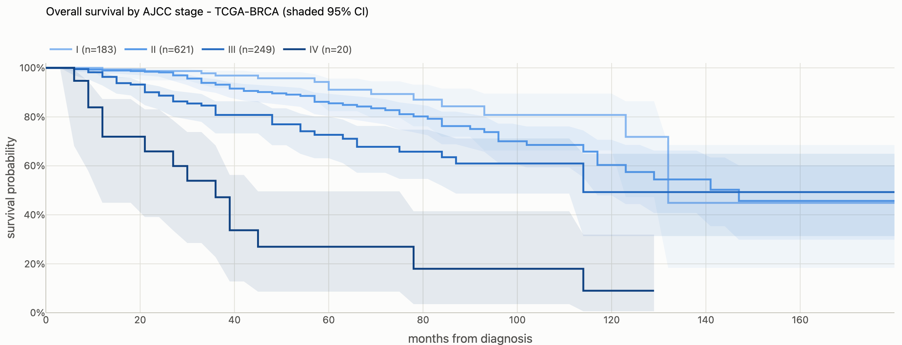</td>
</tr>
<tr>
<td>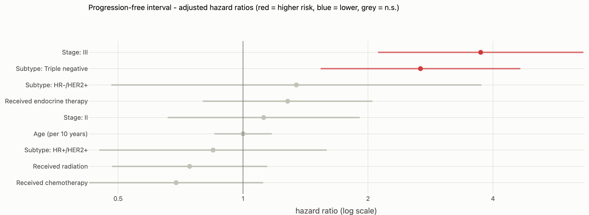</td>
<td>

### 🔁 What's associated with progression?

- Stage III: **HR 3.7** (95% CI 2.1–6.6). Triple-negative: **HR 2.7** (1.5–4.7).
- Recurrence ML on METABRIC: 5-fold CV ROC-AUC **≈ 0.71** (logistic, random forest and XGBoost agree), a
  realistic ceiling for clinicopathologic-only features.
- **Why it matters:** follow-up intensity can be targeted at the highest-risk profiles.

</td>
</tr>
<tr>
<td>

### ⚖️ Older patients are far less likely to get indicated chemotherapy

- For TNBC/HER2+ stage II–III disease (where chemo is strongly indicated), receipt falls from **86%** (age
  40–49) to **21%** (age 75+), FDR-adjusted p < 0.001.
- Some of this is appropriate individualisation for frailty. A gap this large is a question for tumour boards.
- Differences by race are significant for radiation and HER2-targeted therapy, but are **confounded by site and
  era of data capture** (documented, not over-claimed).

</td>
<td>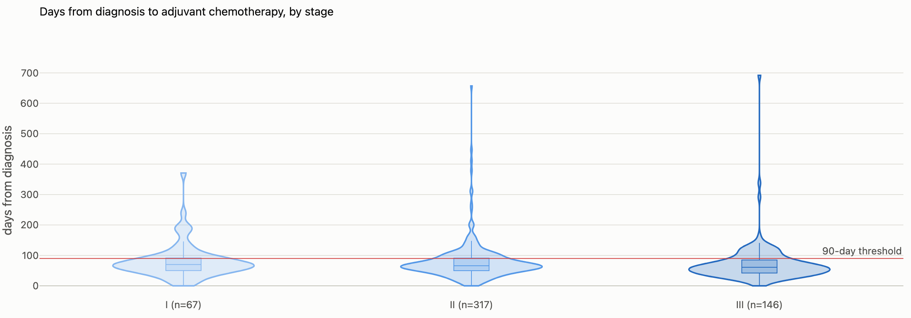</td>
</tr>
<tr>
<td>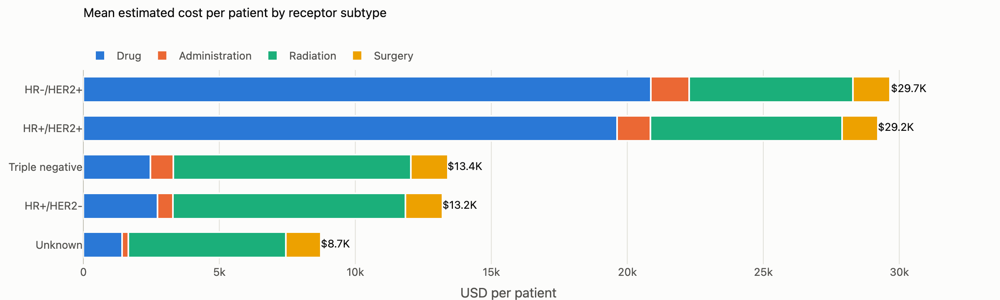</td>
<td>

### 💵 HER2+ care costs ~2.2× more, and policy levers are measurable

- Mean estimated cost: **$29.2K** (HR+/HER2+) vs **$13.2K** (HR+/HER2−), driven by trastuzumab.
- What-if: moving whole-breast radiation to **16 fractions** (hypofractionation) cuts the cohort's estimated cost
  by **21%** (−$3.57M across 1,098 patients). Try it on the Cost page.
- Costs use **2026 CMS national prices** (PFS, ASP, NADAC) × each patient's *observed* utilisation.

</td>
</tr>
</table>

<details>
<summary><b>🔬 How each finding is computed (methods)</b></summary>

| Finding | Method | Where |
|---|---|---|
| Late chemo starts | Days from index diagnosis to first delivered chemotherapy, adjuvant 0–730 d | `marts.mart_treatment_delay` |
| O/E by site | Logistic model on stage + subtype + age group → expected count per site; exact Poisson CI on observed; treating sites with n ≥ 20 | `analytics.hospital_risk_adjusted_delay` |
| Survival | Kaplan-Meier with Greenwood CIs; multivariate log-rank; Cox PH (ridge 0.01) with Schoenfeld tests and events-per-variable checks | `analytics.km_*`, `analytics.cox_*` |
| RMST | Restricted mean survival time at a user-chosen horizon (lifelines) | Cohort lab, `POST /survival/compare` |
| Recurrence models | 5-year relapse label (censored < 60 mo excluded), 5-fold stratified CV + 25% hold-out, calibration, permutation importance | `analytics.recurrence_*` |
| Equity | Wilson 95% CIs, χ²/Fisher, Kruskal-Wallis/Mann-Whitney, Benjamini-Hochberg FDR | `analytics.disparity_*` |
| Cost | Line-level micro-costing: units (cycles/fractions/days or standard regimen) × CMS 2026 unit price | `core.fact_estimated_cost` |

All results are **observational associations**, not causal effects. See [assumptions & limitations](docs/assumptions_and_limitations.md).
</details>

---

## ⚙️ What happens when you run it

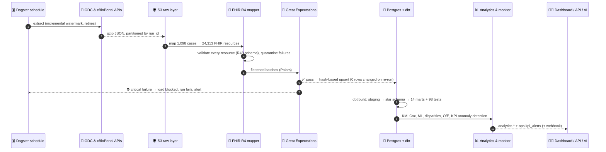
```mermaid
sequenceDiagram
    autonumber
    participant D as 🗓️ Dagster schedule
    participant G as 🧬 GDC & cBioPortal APIs
    participant S as 🪣 S3 raw layer
    participant F as 🏥 FHIR R4 mapper
    participant Q as 🧪 Great Expectations
    participant W as 🐘 Postgres + dbt
    participant A as 📊 Analytics & monitor
    participant U as 👩‍💼 Dashboard / API / AI
    D->>G: extract (incremental watermark, retries)
    G-->>S: gzip JSON, partitioned by run_id
    S->>F: map 1,098 cases → 24,313 FHIR resources
    F->>F: validate every resource (R4B schema), quarantine failures
    F->>Q: flattened batches (Polars)
    Q-->>W: ✅ pass → hash-based upsert (0 rows changed on re-run)
    Q--xD: ⛔ critical failure → load blocked, run fails, alert
    W->>W: dbt build: staging → star schema → 14 marts + 98 tests
    W->>A: KM, Cox, ML, disparities, O/E, KPI anomaly detection
    A-->>U: analytics.* + ops.kpi_alerts (+ webhook)
```

| Step | What happens | Why it matters |
|---|---|---|
| 1 · Extract | Paginated pulls from the GDC `/cases` API (with treatment, follow-up and molecular-test expansions) and cBioPortal, with exponential backoff and incremental watermarks | Reliable, repeatable ingestion that only re-reads what changed |
| 2 · FHIR R4 | Each case becomes `Patient`, `Condition`, `Observation` (LOINC-coded stage, TNM, ER/PR/HER2), `Procedure`, `MedicationAdministration`/`Statement` and `Encounter` resources | Mirrors how EHR data really arrives (Bulk FHIR). Source quirks stay out of the warehouse |
| 3 · Quality gate | Great Expectations validates *before* load. Critical checks block, warnings are logged to `ops.dq_results` | Bad data never reaches a dashboard |
| 4 · Load | COPY + upsert on id, rewritten only when a SHA-256 record hash changes, soft deletes on full refresh | Idempotent and incremental. Re-runs are free |
| 5 · Model | dbt: staging views → business logic → star schema (incremental facts) → 14 marts, 98 tests incl. referential integrity | One governed definition of every metric |
| 6 · Analyse | lifelines, statsmodels, SciPy, scikit-learn/XGBoost write results back to `analytics.*` | Statistics are versioned, queryable data |
| 7 · Monitor | Each KPI vs a trailing 3-year median; alert when Δ ≥ 25%, n ≥ 8, robust z ≥ 2 | Problems are surfaced, not discovered |
| 8 · Serve | Streamlit, FastAPI, Power BI kit, Claude assistant, all on a **read-only** role | Least privilege; the AI can't touch raw data |

<details>
<summary><b>🏗️ Full architecture diagram</b></summary>

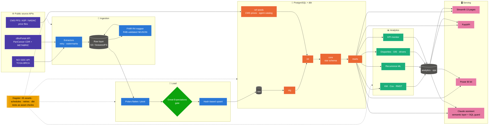
```mermaid
flowchart LR
  subgraph Sources["🌐 Public source APIs"]
    GDC[NCI GDC API<br/>TCGA-BRCA]:::src
    CBIO[cBioPortal API<br/>PanCancer CDR + METABRIC]:::src
    CMS[CMS PFS / ASP / NADAC<br/>price files]:::src
  end
  subgraph Ingest["🐍 Ingestion"]
    EX[Extractors<br/>retry · watermarks]:::py
    RAW[(Raw layer<br/>S3 / SeaweedFS)]:::store
    FHIR[FHIR R4 mapper<br/>R4B-validated NDJSON]:::py
  end
  subgraph Load["🧪 Load"]
    FLAT[Polars flatten / pivot]:::py
    GX{Great Expectations<br/>gate}:::qa
    UPS[Hash-based upsert]:::py
  end
  subgraph WH["🐘 PostgreSQL + dbt"]
    RAWT[(raw)]:::store --> STG[stg]:::dbt --> INT[int]:::dbt --> CORE[core<br/>star schema]:::dbt --> MARTS[marts]:::dbt
    SEEDS[ref seeds<br/>CMS prices · agent catalog]:::dbt --> INT
  end
  subgraph Analytics["📊 Analytics"]
    SURV[KM · Cox · RMST]:::an
    ML[Recurrence ML]:::an
    STATS[Disparities · O/E · drivers]:::an
    MON[KPI monitor]:::an
  end
  subgraph Serve["🖥️ Serving"]
    ST[Streamlit 13 pages]:::srv
    API[FastAPI]:::srv
    PBI[Power BI kit]:::srv
    AI[Claude assistant<br/>semantic layer + SQL guard]:::srv
  end
  GDC & CBIO --> EX --> RAW --> FHIR --> RAW
  RAW --> FLAT --> GX --> UPS --> RAWT
  CMS --> SEEDS
  MARTS --> SURV & ML & STATS & MON --> ANA[(analytics · ops)]:::store
  MARTS & ANA --> ST & API & PBI & AI
  DAG[[Dagster: 65 assets · schedules · retries · dbt tests as asset checks]]:::orch -.-> Ingest & Load & WH & Analytics
  classDef src fill:#4a3aa7,color:#fff,stroke:#fff
  classDef py fill:#2a78d6,color:#fff,stroke:#fff
  classDef store fill:#52514e,color:#fff,stroke:#fff
  classDef qa fill:#0ca30c,color:#fff,stroke:#fff
  classDef dbt fill:#eb6834,color:#fff,stroke:#fff
  classDef an fill:#1baf7a,color:#fff,stroke:#fff
  classDef srv fill:#e87ba4,color:#000,stroke:#fff
  classDef orch fill:#eda100,color:#000,stroke:#fff
```

| Layer | Technology |
|---|---|
| Interoperability | FHIR R4 (`fhir.resources` R4B validation), US Core race/ethnicity, LOINC, ICD-10, ICD-O-3 |
| Storage | AWS S3 (Terraform) · SeaweedFS S3 locally · local filesystem |
| ETL | Python, httpx + tenacity, Polars |
| Data quality | Great Expectations (pre-load) + 98 dbt tests (post-load) |
| Warehouse | PostgreSQL 16, dbt (staging → intermediate → star schema → marts, incremental facts, exposures) |
| Orchestration | Dagster (software-defined assets, dagster-dbt, schedules, retry policies, failure sensor) |
| Statistics | lifelines (KM, log-rank, Cox PH, RMST), SciPy, statsmodels (logit, quantile regression, FDR) |
| ML | scikit-learn, XGBoost (automatic HistGradientBoosting fallback) |
| Serving | Streamlit + Plotly, FastAPI (optional API-key auth, request-id logging), Power BI kit |
| AI | Anthropic Claude (tool use, prompt caching, server-side refusal fallback) over a YAML semantic layer |
| DevOps | Docker Compose, GitHub Actions (lint · unit · offline full-pipeline integration · image build · `terraform validate`), Terraform (S3, KMS, RDS, ECR, ECS Fargate, EventBridge Scheduler, Secrets Manager), pre-commit, Makefile |
</details>

---

## 🗄️ Real data, not synthetic

| Source | What it provides | Size |
|---|---|---|
| **NCI Genomic Data Commons** · TCGA-BRCA | Demographics, AJCC stage/TNM, histology, ER/PR/HER2 tests, **dated** surgery/radiation/drug records (65 agents), follow-ups, recurrence, contributing site | 1,098 patients · 4,948 treatments · 12,957 observations |
| **cBioPortal** · TCGA PanCancer Atlas | Curated OS / DSS / PFI / DFI endpoints (Liu et al., *Cell* 2018), PAM50 subtype | 1,084 patients |
| **cBioPortal** · METABRIC | Independent validation cohort with ~10-year follow-up, tumour size, grade, surgery type | 2,509 patients |
| **CMS & Medicaid** | 2026 Physician Fee Schedule (RVU26D), Oct-2026 ASP Part B limits, NADAC | 35 reference prices |

<details>
<summary><b>🧹 The messy parts of real data, and how they're handled</b></summary>

| Real-world problem | How OncoInsight handles it |
|---|---|
| 537 drug records have no dates | Kept as FHIR `MedicationStatement`; count as "received" but not in sequences; `pathway_is_complete` flag |
| 10 of 40 "hospitals" are tissue biobanks | Classified in `ref_site_classification`; excluded from benchmarking |
| Drug classes mislabelled at source (trastuzumab as "chemotherapy") | Curated agent catalog normalises 60+ raw agent names |
| Surgery type not reported | Cost model blends lumpectomy/mastectomy fees; documented |
| Dates only as offsets + diagnosis year | Exact day offsets for every interval; anchored dates for FHIR only |
| HER2 tested by both IHC and FISH | ASCO/CAP-style resolution: FISH overrides IHC |
| Readmissions, claims, insurance don't exist publicly | Documented as out of scope; **never invented** |
</details>

---

## 🤖 The AI analytics assistant

Ask *"Show me Stage III patients receiving chemotherapy and compare their treatment completion rates across
hospitals"* and Claude:

1. picks a **governed metric** from the [semantic layer](src/oncoinsight/assistant/semantic_layer.yml) (or writes SQL that must pass the [SQL guard](src/oncoinsight/assistant/sql_guard.py)),
2. runs it as the **read-only** `onco_reader` role (30 s timeout, n < 11 suppressed),
3. explains the result, and shows **every query it ran** for audit.

<details>
<summary><b>Example: the governed-metric tool call it makes (real output from this warehouse)</b></summary>

`query_metric(metric="median_days_to_chemotherapy", dimensions=["stage_major"])` compiles to parameterised SQL:

```sql
select "stage_major",
       percentile_cont(0.5) within group (order by days_to_chemotherapy)
           filter (where days_to_chemotherapy between 0 and 730) as value,
       count(*) filter (where days_to_chemotherapy between 0 and 730) as n
from marts.mart_patient_360
group by "stage_major" order by value asc nulls last limit 100
```

| stage_major | value (median days) | n |
|---|---|---|
| III | 61 | 146 |
| II | 66 | 317 |
| I | 70 | 67 |
| IV | *suppressed* | 7 |

Stage III patients start chemotherapy *sooner*. That's clinically plausible, since higher-risk disease gets
expedited.
</details>

Set `ANTHROPIC_API_KEY` in `.env` to enable it. It defaults to `claude-opus-5` with server-side refusal
fallback, configurable via `ONCO_ASSISTANT_MODEL`.

---

## 🧪 Quality & trust

| Layer | What's checked | Count |
|---|---|---|
| FHIR | Every generated resource validated against the R4B schema | 24,313 / 24,313 valid |
| Great Expectations | Keys, required fields, FHIR value sets, barcode format (critical, block the load) + plausibility (warnings) | 72 expectations |
| dbt | Uniqueness, not-null, accepted values, **relationships**, custom generic + singular reconciliation tests | 98 tests |
| Python | Unit tests (FHIR, quality gate, semantic layer, SQL guard, agent loop with a mocked model, cohorts, charts, cost simulator) + integration tests (API, read-only role, reconciliation) | 48 tests |
| CI | Lint → unit → **full pipeline offline on real-data fixtures** → integration → Docker build → `terraform validate` | GitHub Actions |

---

## 🚀 Run it yourself

Prerequisites: Docker, [uv](https://docs.astral.sh/uv/), Python 3.11. Run `make help` to list every command.

```bash
make setup
```

```bash
make up
```

```bash
make pipeline
```

That pulls the live public data, builds FHIR, validates, loads, runs `dbt build`, the analytics and the KPI
monitor (about 2 minutes). Then open the dashboard at http://localhost:8503:

```bash
make dashboard
```

To run everything in containers (Dagster UI :3001, API :8010/docs, dashboard :8502):

```bash
make stack
```

No network? Use the committed real-data fixtures:

```bash
make offline
```

Tests:

```bash
make test
```

### 📂 Repository guide

Every folder has its own README explaining what it contains and why. Click through:

| Folder | What's inside |
|---|---|
| [`src/oncoinsight/`](src/oncoinsight/) | The Python package: [ingestion](src/oncoinsight/ingestion/) · [FHIR](src/oncoinsight/fhir/) · [quality gate](src/oncoinsight/quality/) · [loading](src/oncoinsight/loading/) · [analytics](src/oncoinsight/analytics/) · [monitoring](src/oncoinsight/monitoring/) · [AI assistant](src/oncoinsight/assistant/) · [REST API](src/oncoinsight/api/) · [common](src/oncoinsight/common/) |
| [`dbt/oncoinsight/`](dbt/oncoinsight/) | Warehouse: [staging](dbt/oncoinsight/models/staging/) → [intermediate](dbt/oncoinsight/models/intermediate/) → [star schema](dbt/oncoinsight/models/marts/core/) → [analysis marts](dbt/oncoinsight/models/marts/analytics/), plus [seeds](dbt/oncoinsight/seeds/), [macros](dbt/oncoinsight/macros/) and [tests](dbt/oncoinsight/tests/) |
| [`dagster_project/`](dagster_project/) | Orchestration: 65 assets, 81 asset checks, schedules, retries, failure sensor |
| [`app/`](app/) | Streamlit dashboard: design system, chart library, [13 pages](app/pages/) |
| [`tests/`](tests/) | 48 unit + integration tests and [real-data fixtures](tests/fixtures/) |
| [`docker/`](docker/) | Container image and service configuration for the full local stack |
| [`infra/terraform/`](infra/terraform/) | AWS: KMS, S3, RDS, ECR, ECS Fargate, EventBridge Scheduler, IAM |
| [`.github/workflows/`](.github/workflows/) | CI: lint, unit, offline end-to-end pipeline, image build, Terraform validation |
| [`scripts/`](scripts/) | Fixtures, README assets, data dictionary, Power BI export |
| [`powerbi/`](powerbi/) | Power BI connection guide, star-schema relationships, DAX measures, theme |
| [`docs/`](docs/) | Architecture, data sources, data dictionary, metric definitions, limitations, runbook, cost provenance |

---

## ❓ FAQ

<details><summary><b>Is this real patient data? Is it allowed?</b></summary>

Yes, it is real, de-identified, open-access research data from The Cancer Genome Atlas (via the NCI Genomic Data
Commons) and METABRIC (via cBioPortal). No login or data-use agreement is needed for these clinical fields.
Please cite the original studies (below).
</details>

<details><summary><b>Why not just build a "predict cancer yes/no" model?</b></summary>

Because that's not what a cancer centre needs. Diagnosis is already known. The operational and clinical value
lies in the *journey*: delays, pathway variation, outcomes by group, cost, equity. Prediction is one layer
(recurrence risk), placed after descriptive analytics, as real analytics teams do.
</details>

<details><summary><b>Why FHIR, if the source isn't FHIR?</b></summary>

Real hospital data increasingly arrives as FHIR (US Core / Bulk FHIR). Mapping the source into validated FHIR
resources and having the warehouse ingest *only* FHIR proves the pipeline would work on an EHR feed, and it
keeps source quirks out of the models.
</details>

<details><summary><b>Can I trust the hospital comparisons?</b></summary>

They're the right *kind* of comparison: only treating facilities with ≥ 20 patients, case-mix adjustment
(observed ÷ expected) and exact confidence intervals. But TCGA sites contributed tissue for research; they
weren't sampled to represent their practice. Treat flags as leads to investigate, not rankings.
</details>

<details><summary><b>Where do the costs come from?</b></summary>

From 2026 CMS national payment rates applied to each patient's observed treatment (cycles, radiation fractions,
therapy days), with standard regimen defaults when utilisation is missing. They're estimates for comparing
pathways, not charges. Hospital facility fees (OPPS) are excluded because that file requires accepting an AMA
licence. See [cost sources](docs/cost_reference_sources.md).
</details>

<details><summary><b>What's missing?</b></summary>

Readmissions, missed appointments, insurance and claims don't exist in any public patient-level oncology
dataset. The platform documents this rather than inventing data. The Terraform is validated but not deployed.
Power BI Desktop is Windows-only, so the Power BI kit contains the model design, DAX and theme rather than a `.pbix`.
</details>

<details><summary><b>📚 Glossary for non-clinicians</b></summary>

| Term | Meaning |
|---|---|
| **Adjuvant** | Treatment given *after* surgery to lower recurrence risk (neoadjuvant = before surgery) |
| **ER / PR / HER2** | Tumour receptors. Hormone-receptor-positive (HR+) cancers respond to endocrine therapy; HER2+ cancers respond to HER2-targeted drugs like trastuzumab |
| **Triple negative (TNBC)** | ER−, PR−, HER2−; the most aggressive subtype with fewest targeted options |
| **AJCC stage** | Extent of cancer: I (small, localised) → IV (spread to distant organs) |
| **Kaplan-Meier curve** | Share of patients still event-free over time, handling patients still being followed ("censored") |
| **Hazard ratio (HR)** | Relative event rate between groups, adjusted for other factors. HR 2 = twice the rate |
| **RMST** | Restricted mean survival time: average event-free months within a horizon (e.g. 5 years) |
| **Hypofractionation** | Delivering radiation in fewer, larger doses (e.g. 16 instead of 25 sessions) |
| **O/E ratio** | Observed ÷ expected events given case mix. Above 1 = worse than expected |
</details>

---

## 🧑‍💼 What this project demonstrates

| Skill | Evidence in the repo |
|---|---|
| **SQL & data modelling** | dbt star schema, incremental facts, window functions, grouping sets, 98 tests |
| **Statistics** | Kaplan-Meier, log-rank, Cox PH + Schoenfeld, RMST, quantile regression, O/E with exact CIs, FDR |
| **Healthcare domain** | FHIR R4/mCODE mapping, LOINC/ICD coding, ASCO/CAP receptor logic, guideline-concordance measures |
| **Data engineering** | API ingestion with retries/watermarks, S3 raw layer, Polars, idempotent upserts, soft deletes |
| **Data quality** | Great Expectations gate (critical vs warning), dbt tests, quarantine, reconciliation tests |
| **Orchestration & DevOps** | Dagster assets/schedules/sensors, Docker, GitHub Actions, Terraform, pre-commit |
| **BI & visualisation** | 13-page interactive dashboard, validated colour system, Power BI model + DAX |
| **ML** | Recurrence models with CV, calibration and permutation importance |
| **Applied AI** | Tool-using Claude agent over a governed semantic layer with a SQL guard and audit trail |

---

## 📖 Documentation

[Architecture](docs/architecture.md) · [Data sources & FHIR mapping](docs/data_sources.md) ·
[Data dictionary](docs/data_dictionary.md) · [Metric definitions](docs/metric_definitions.md) ·
[Assumptions & limitations](docs/assumptions_and_limitations.md) · [Runbook](docs/runbook.md) ·
[Cost sources](docs/cost_reference_sources.md) · [Power BI kit](powerbi/README.md)

## 📚 Citations

TCGA: The Cancer Genome Atlas Research Network; NCI Genomic Data Commons (Grossman et al., *NEJM* 2016).
Curated endpoints: Liu J. et al., *Cell* 2018;173:400-416. METABRIC: Curtis C. et al., *Nature* 2012; Pereira B.
et al., *Nat Commun* 2016; Rueda O.M. et al., *Nature* 2019. cBioPortal: Cerami et al., *Cancer Discov* 2012;
Gao et al., *Sci Signal* 2013. Chemotherapy timing: Chavez-MacGregor M. et al., *JAMA Oncol* 2016.

<sub>⚠️ Portfolio project on public research data. Observational associations only; not for clinical decisions.</sub>
