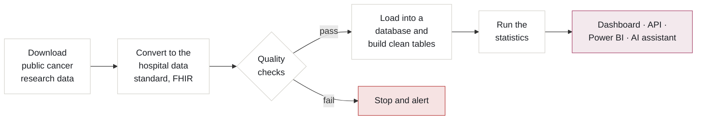
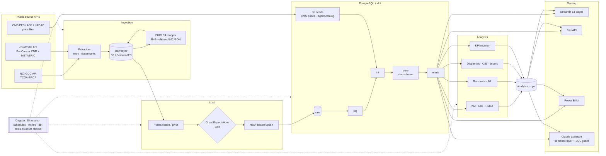

<p align="center">
  
</p>

<p align="center">
  
  <a href="https://github.com/RajivPraveen/OncoInsight/actions/workflows/ci.yml"></a>
  
</p>

<p align="center">
  <a href="#what-is-this">What is this?</a> ·
  <a href="#what-it-found">What it found</a> ·
  <a href="#the-dashboard">The dashboard</a> ·
  <a href="#how-it-works">How it works</a> ·
  <a href="#run-it-yourself">Run it</a> ·
  <a href="#for-technical-reviewers">Technical details</a>
</p>

## What is this?

**OncoInsight helps a hospital network see where breast cancer patients wait too long for treatment, and what
that waiting costs them.**

After a breast cancer diagnosis, a patient goes through a relay of treatments: surgery, then often chemotherapy,
radiation and years of hormone therapy. Each step is run by a different team, and every hand-off is a chance to
wait. Waiting matters: patients who start chemotherapy **more than 90 days** after surgery have worse survival
(Chavez-MacGregor et al., *JAMA Oncology*, 2016).

OncoInsight follows **1,098 real, de-identified breast cancer patients** from diagnosis to outcome and answers the
questions a cancer network's leadership actually asks:

| The question | Where to look |
|---|---|
| How long do patients wait, and at which step? | **Waiting times** page |
| Is any hospital slower than it should be, once you allow for how sick its patients are? | **Waiting times**, **Hospital comparison** |
| Which treatments do patients get, and in what order? | **Treatment paths** |
| How do patients do afterwards? Who is most likely to have the cancer come back? | **Survival**, **Cancer returning** |
| What does care cost, and what could be saved? | **Cost** (with a what-if simulator) |
| Do older patients, or patients of different races, miss out on recommended treatment? | **Fairness of care** |

No patient is invented. The data comes from two public cancer research studies (details [below](#the-data)).

---

## What it found

<table>
<tr>
<td width="50%"></td>
<td width="50%">

### 1 in 4 patients wait too long for chemotherapy, and one hospital is 2.6× worse than expected

- The typical wait from diagnosis to chemotherapy is **65 days**, but **25%** of patients wait more than 90.
- After allowing for each hospital's mix of patients (stage, tumour type, age), **University of Miami** has
  **2.6×** the expected number of late starts. **Mayo** has none.
- **Why it matters:** the gap isn't explained by sicker patients, so it points to something fixable, like
  referrals, scheduling or capacity.

</td>
</tr>
<tr>
<td>

### Waiting is linked to survival, and stage matters most

- Patients who started chemotherapy **within 90 days**: **93%** alive after 5 years. Those who waited longer:
  **82%** (a simple comparison, not adjusted for other factors).
- Five years after diagnosis, **91%** of stage I patients are alive, compared with **27%** at stage IV.
- Triple-negative tumours, which have the fewest drug options, have the lowest survival of the tumour types.

</td>
<td></td>
</tr>
<tr>
<td></td>
<td>

### Some patients are much more likely to have the cancer return

- Stage III cancer carries about **3.7×** the risk of the cancer growing or coming back. Triple-negative tumours
  carry about **2.7×**.
- A machine-learning model predicts 5-year relapse correctly about **7 times in 10** (AUC 0.71). That's the
  normal ceiling when you only have clinical information and no genetic tests.
- **Why it matters:** follow-up care can be focused on the patients most at risk.

</td>
</tr>
<tr>
<td>

### Older patients are far less likely to get recommended chemotherapy

- Where guidelines strongly recommend chemotherapy, **86%** of 40–49 year-olds receive it, but only **21%** of
  those aged 75+.
- Some of this is appropriate (frail patients may not cope with chemo), but a gap this large is worth reviewing.
- Differences by race exist for some treatments but are tangled up with which hospital the data came from, so
  the project reports them without over-claiming.

</td>
<td></td>
</tr>
<tr>
<td></td>
<td>

### HER2+ patients cost about 2× more, and one change could cut costs by 21%

- Average estimated cost: **$29K** for HR+/HER2+ patients vs. **$13K** for HR+/HER2−, driven by the HER2 drug
  trastuzumab.
- Giving radiation in **16 larger doses instead of 25** (proven equally effective in clinical trials) would cut
  the group's total cost by **21%**, or $3.6M across 1,098 patients.
- Costs are each patient's actual treatments priced at **2026 Medicare rates**.

</td>
</tr>
</table>

All results are patterns in observational data, not proof of cause and effect. See
[assumptions & limitations](docs/assumptions_and_limitations.md).

---

## The dashboard

A 13-page interactive dashboard. Every page opens with **the question it answers and the short answer**, and
every chart has a one-line "how to read this". One row of filters (year, stage, tumour type, age, hospital type)
applies to every chart on every page.

| | |
|---|---|
| <br>**Overview**: the question, the short answer, the patient journey, and who the patients are. | <br>**Waiting times**: slide the "too long" threshold, compare groups, click a hospital to see its patients. |
| <br>**Treatment paths**: how patients flow from diagnosis through each treatment to their outcome. | <br>**Survival**: pick any two groups of patients and compare how they do over time. |
| <br>**Cost**: where the money goes, and a simulator for cost-saving changes. | <br>**Hospital comparison**: a report card for every hospital, plus automatic alerts. |

<details>
<summary><b>All 13 pages</b></summary>

| Section | Page | What you can do |
|---|---|---|
| Start here | Overview | See the question, the headline numbers and the typical patient journey |
| | The story in 2 minutes | The problem, the data, the four main findings, and how it was built |
| The patient journey | Waiting times | Change what counts as "too long", compare groups, click a hospital, see fair (adjusted) comparisons |
| | Treatment paths | Follow patients through each treatment; click a path to see its patients |
| | One patient's journey | Pick any patient and see every treatment on a timeline |
| Results | Survival | Compare any two groups; see which factors matter most |
| | Cancer returning | Recurrence rates by group, a risk calculator, and how good the prediction is |
| | Cost | Cost by path, stage or tumour type; a what-if simulator |
| | Fairness of care | Who gets recommended treatment, by age and race |
| | Hospital comparison | Report card, year-by-year animation, trend explorer, alerts |
| Behind the scenes | Ask the data (AI) | Ask a question in plain English; see the exact queries it ran |
| | Data checks | Every automatic quality check and what didn't pass |
| | How the data flows | An interactive map of every table and where its data comes from |

Groups of fewer than 11 patients are hidden for privacy, and every table has a CSV download.
</details>

---

## How it works



1. **Download** every patient record from two public cancer databases. Only new or changed records are re-downloaded.
2. **Convert** each record to FHIR, the format real hospital systems use, so the same pipeline would work on a
   real hospital's data feed.
3. **Check quality** automatically. Serious problems stop the load; nothing bad reaches the dashboard.
4. **Load and organise** into a PostgreSQL database with tested tables, so every number has one agreed definition.
5. **Analyse**: survival curves, risk models, fairness tests, and fair hospital comparisons.
6. **Share** through the dashboard, an API, a Power BI model, and an AI assistant that can only read data.

It runs on a schedule (daily updates, weekly full refresh) and raises an alert if a measure suddenly jumps.

---

## Run it yourself

You need Docker, [uv](https://docs.astral.sh/uv/) and Python 3.11. `make help` lists every command.

```bash
make setup
```

```bash
make up
```

```bash
make pipeline
```

That downloads the public data and builds everything (about 2 minutes). Then open the dashboard at
http://localhost:8503:

```bash
make dashboard
```

No internet? `make offline` uses real-data samples committed to the repo. Run the tests with `make test`.

---

## The data

| Source | What it provides | Size |
|---|---|---|
| **TCGA breast cancer study** (via the NCI Genomic Data Commons) | Age, stage, tumour type, every dated surgery, radiation and drug treatment, follow-up visits, outcomes, and the contributing hospital | 1,098 patients · 4,948 treatments |
| **TCGA PanCancer Atlas** (via cBioPortal) | Carefully checked survival and recurrence outcomes | 1,084 patients |
| **METABRIC** (via cBioPortal) | A separate UK/Canadian group with ~10 years of follow-up, used to double-check results and train the risk model | 2,509 patients |
| **Medicare (CMS) 2026 price files** | Official prices for doctor services, drugs and radiation | 35 prices |

All are public and de-identified; no login or data-use agreement is needed for these fields. Things no public
dataset contains (readmissions, insurance, claims) are **left out rather than invented**.

---

## For technical reviewers

<details>
<summary><b>Tech stack</b></summary>

| Layer | Technology |
|---|---|
| Interoperability | FHIR R4 (`fhir.resources` R4B validation), US Core race/ethnicity, LOINC, ICD-10, ICD-O-3 |
| Storage | AWS S3 (Terraform) · SeaweedFS S3 locally · local filesystem |
| ETL | Python, httpx + tenacity, Polars |
| Data quality | Great Expectations (72 pre-load expectations) + 98 dbt tests (post-load) |
| Warehouse | PostgreSQL 16, dbt (staging → intermediate → star schema → 14 marts, incremental facts, exposures) |
| Orchestration | Dagster (65 software-defined assets, dagster-dbt, schedules, retry policies, failure sensor) |
| Statistics | lifelines (Kaplan-Meier, log-rank, Cox PH, RMST), SciPy, statsmodels (logit, quantile regression, FDR) |
| ML | scikit-learn, XGBoost (automatic HistGradientBoosting fallback) |
| Serving | Streamlit + Plotly, FastAPI (optional API-key auth, request-id logging), Power BI kit |
| AI | Anthropic Claude (tool use, prompt caching) over a YAML semantic layer with a SQL guard |
| DevOps | Docker Compose, GitHub Actions (lint · unit · offline full-pipeline integration · image build · `terraform validate`), Terraform (S3, KMS, RDS, ECR, ECS Fargate, EventBridge Scheduler, Secrets Manager), pre-commit |
</details>

<details>
<summary><b>Full architecture</b></summary>



| Step | What happens | Why it matters |
|---|---|---|
| Extract | Paginated pulls from the GDC `/cases` API (treatment, follow-up and molecular-test expansions) and cBioPortal, with exponential backoff and incremental watermarks | Reliable, repeatable ingestion that only re-reads what changed |
| FHIR R4 | Each case becomes `Patient`, `Condition`, `Observation` (LOINC-coded stage, TNM, ER/PR/HER2), `Procedure`, `MedicationAdministration`/`Statement` and `Encounter` resources; 24,313 resources, all validated | Mirrors how EHR data really arrives (Bulk FHIR) |
| Quality gate | Great Expectations validates *before* load. Critical checks block; warnings go to `ops.dq_results` | Bad data never reaches a dashboard |
| Load | COPY + upsert on id, rewritten only when a SHA-256 record hash changes; soft deletes on full refresh | Idempotent and incremental |
| Model | dbt: staging views → business logic → star schema → 14 marts, 98 tests incl. referential integrity | One governed definition of every metric |
| Analyse | lifelines, statsmodels, SciPy, scikit-learn/XGBoost write results back to `analytics.*` | Statistics are versioned, queryable data |
| Monitor | Each KPI vs. a trailing 3-year median; alert when Δ ≥ 25%, n ≥ 8, robust z ≥ 2 | Problems are surfaced, not discovered |
| Serve | Streamlit, FastAPI, Power BI kit, Claude assistant, all on a **read-only** role | Least privilege |
</details>

<details>
<summary><b>How each finding is computed</b></summary>

| Finding | Method | Where |
|---|---|---|
| Late chemo starts | Days from index diagnosis to first delivered chemotherapy, adjuvant 0–730 d | `marts.mart_treatment_delay` |
| Actual vs. expected by hospital | Logistic model on stage + subtype + age group → expected count per site; exact Poisson CI on observed; treating sites with n ≥ 20 | `analytics.hospital_risk_adjusted_delay` |
| Survival | Kaplan-Meier with Greenwood CIs; multivariate log-rank; Cox PH (ridge 0.01) with Schoenfeld tests and events-per-variable checks | `analytics.km_*`, `analytics.cox_*` |
| Group comparison | Restricted mean survival time at a user-chosen horizon + log-rank (lifelines) | Survival page, `POST /survival/compare` |
| Recurrence models | 5-year relapse label (censored < 60 mo excluded), 5-fold stratified CV + 25% hold-out, calibration, permutation importance | `analytics.recurrence_*` |
| Fairness | Wilson 95% CIs, χ²/Fisher, Kruskal-Wallis/Mann-Whitney, Benjamini-Hochberg FDR | `analytics.disparity_*` |
| Cost | Line-level micro-costing: units (cycles/fractions/days or standard regimen) × CMS 2026 unit price | `core.fact_estimated_cost` |
</details>

<details>
<summary><b>The messy parts of real data, and how they're handled</b></summary>

| Real-world problem | How OncoInsight handles it |
|---|---|
| 537 drug records have no dates | Kept as FHIR `MedicationStatement`; count as "received" but not in sequences; `pathway_is_complete` flag |
| 10 of 40 "hospitals" are tissue biobanks | Classified in `ref_site_classification`; excluded from hospital comparisons |
| Drug classes mislabelled at source (trastuzumab as "chemotherapy") | Curated agent catalog normalises 60+ raw agent names |
| Surgery type not reported | Cost model blends lumpectomy/mastectomy fees; documented |
| Dates only as offsets + diagnosis year | Exact day offsets for every interval; anchored dates for FHIR only |
| HER2 tested by both IHC and FISH | ASCO/CAP-style resolution: FISH overrides IHC |
</details>

<details>
<summary><b>The AI assistant</b></summary>

Ask *"Show me stage III patients receiving chemotherapy and compare their treatment completion rates across
hospitals"* and Claude:

1. picks a **governed metric** from the [semantic layer](src/oncoinsight/assistant/semantic_layer.yml), or writes
   SQL that must pass the [SQL guard](src/oncoinsight/assistant/sql_guard.py);
2. runs it as the **read-only** `onco_reader` role (30 s timeout, groups under 11 hidden);
3. explains the result and shows **every query it ran**.

Set `ANTHROPIC_API_KEY` in `.env` to enable it (model configurable via `ONCO_ASSISTANT_MODEL`).
</details>

<details>
<summary><b>Repository guide</b></summary>

Every folder has its own README.

| Folder | What's inside |
|---|---|
| [`src/oncoinsight/`](src/oncoinsight/) | Python package: [ingestion](src/oncoinsight/ingestion/) · [FHIR](src/oncoinsight/fhir/) · [quality gate](src/oncoinsight/quality/) · [loading](src/oncoinsight/loading/) · [analytics](src/oncoinsight/analytics/) · [monitoring](src/oncoinsight/monitoring/) · [AI assistant](src/oncoinsight/assistant/) · [REST API](src/oncoinsight/api/) |
| [`dbt/oncoinsight/`](dbt/oncoinsight/) | Warehouse models, seeds, macros and tests |
| [`dagster_project/`](dagster_project/) | Orchestration: assets, asset checks, schedules, retries, failure sensor |
| [`app/`](app/) | Streamlit dashboard: design system, chart library, [13 pages](app/pages/) |
| [`tests/`](tests/) | 48 unit + integration tests and [real-data fixtures](tests/fixtures/) |
| [`docker/`](docker/) · [`infra/terraform/`](infra/terraform/) | Local container stack · AWS infrastructure |
| [`scripts/`](scripts/) · [`powerbi/`](powerbi/) · [`docs/`](docs/) | Utilities · Power BI kit · architecture, data dictionary, metric definitions, runbook |

To run the whole stack in containers (Dagster :3001, API :8010/docs, dashboard :8502): `make stack`.
</details>

---

## FAQ

<details><summary><b>Is this real patient data? Is it allowed?</b></summary>

Yes. It is real, de-identified, open-access research data from The Cancer Genome Atlas and METABRIC. No login
or data-use agreement is needed for these clinical fields. Please cite the original studies (below).
</details>

<details><summary><b>Why not just build a "does this patient have cancer?" model?</b></summary>

Because the diagnosis is already known. What a cancer centre needs to improve is the *journey*: waits,
treatment choices, outcomes, cost and fairness. Prediction is one part (recurrence risk), not the whole thing.
</details>

<details><summary><b>Can I trust the hospital comparisons?</b></summary>

They're the right *kind* of comparison: only hospitals with at least 20 patients, adjusted for each hospital's
mix of patients, with confidence ranges. But these hospitals sent samples to a research study; they weren't
chosen to represent their everyday practice. Treat flags as leads to investigate, not rankings.
</details>

<details><summary><b>What's missing?</b></summary>

Readmissions, missed appointments, insurance and claims don't exist in any public patient-level cancer dataset,
so they're left out. The AWS infrastructure is validated but not deployed. Power BI Desktop is Windows-only, so
the Power BI kit has the model design, measures and theme rather than a `.pbix` file.
</details>

<details><summary><b>Glossary</b></summary>

| Term | Plain meaning |
|---|---|
| **Stage (I–IV)** | How far the cancer has spread. I = small and local, IV = spread to other organs |
| **Chemotherapy** | Drugs that kill fast-growing cells, usually given in cycles after surgery |
| **Hormone therapy** (endocrine) | Pills that block the hormones some tumours need, often taken for years |
| **HR+ / HER2+ / Triple negative** | Tumour types based on which receptors the tumour has. They decide which drugs can work |
| **Recurrence** | The cancer coming back after treatment |
| **Survival curve** (Kaplan-Meier) | The share of patients still alive (or cancer-free) over time |
| **Risk multiplier** (hazard ratio) | How much a factor raises the risk, with other factors held equal. 2 = double |
| **Actual ÷ expected** (O/E) | A hospital's result divided by what its mix of patients predicts. Above 1 = worse than expected |
| **Hypofractionation** | Giving radiation in fewer, larger doses (e.g. 16 instead of 25 sessions) |
</details>

## Citations

TCGA: The Cancer Genome Atlas Research Network; NCI Genomic Data Commons (Grossman et al., *NEJM* 2016).
Curated endpoints: Liu J. et al., *Cell* 2018;173:400-416. METABRIC: Curtis C. et al., *Nature* 2012; Pereira B.
et al., *Nat Commun* 2016; Rueda O.M. et al., *Nature* 2019. cBioPortal: Cerami et al., *Cancer Discov* 2012;
Gao et al., *Sci Signal* 2013. Chemotherapy timing: Chavez-MacGregor M. et al., *JAMA Oncol* 2016.

<sub>Portfolio project on public research data. Shows patterns, not cause and effect. Not for clinical decisions.</sub>
